# AWS Cloud Migration Reference Architecture

## Table of Contents

- [Overview](#overview)
- [High-Level Migration Architecture](#high-level-migration-architecture)
- [Network Architecture](#network-architecture)
- [Security Architecture](#security-architecture)
- [Data Migration Architecture](#data-migration-architecture)
- [Application Migration Architecture](#application-migration-architecture)
- [Hybrid Connectivity Architecture](#hybrid-connectivity-architecture)
- [Landing Zone Architecture](#landing-zone-architecture)
- [Migration Hub Architecture](#migration-hub-architecture)

---

## Overview

This document provides reference architectures for AWS cloud migration, illustrating the key components, services, and patterns used throughout the migration journey. These architectures follow AWS Well-Architected Framework principles and incorporate best practices for security, reliability, performance, cost optimization, and operational excellence.

---

## High-Level Migration Architecture

### Three-Phase Migration Framework

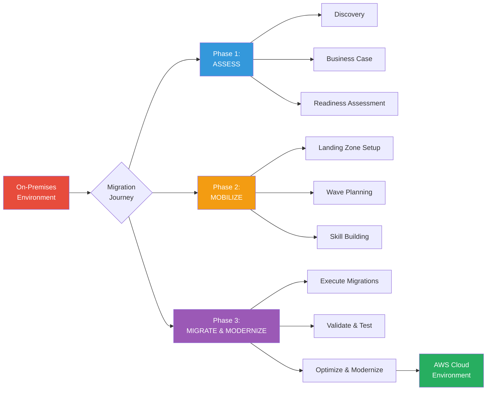

### Complete Migration Ecosystem

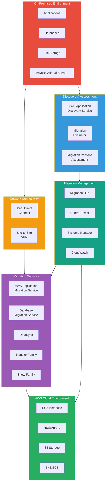

---

## Network Architecture

### AWS Landing Zone Network Architecture

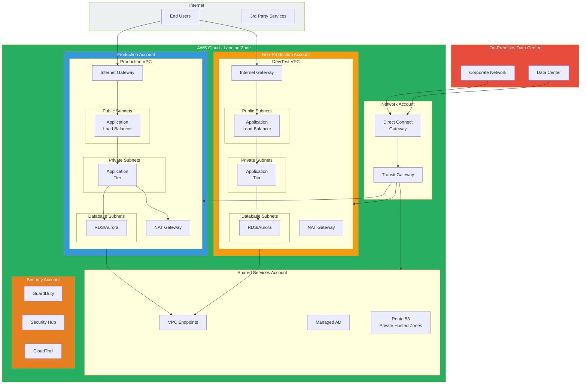

### Hybrid Connectivity Patterns

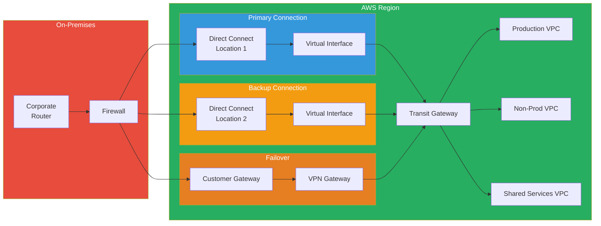

---

## Security Architecture

### Multi-Layer Security Architecture

```mermaid
graph TB
    subgraph Edge["Edge Security"]
        WAF[AWS WAF]
        SHIELD[AWS Shield]
        CF[CloudFront]
    end
    
    subgraph Network["Network Security"]
        NACL[Network ACLs]
        SG[Security Groups]
        FW_MGR[Firewall Manager]
        NWFW[Network Firewall]
    end
    
    subgraph Identity["Identity & Access"]
        IAM[IAM]
        SSO[AWS SSO]
        COGNITO[Cognito]
        SECRETS[Secrets Manager]
    end
    
    subgraph Data["Data Protection"]
        KMS[AWS KMS]
        MACIE[Amazon Macie]
        ENCRYPTION[Encryption at Rest<br/>& In Transit]
    end
    
    subgraph Monitoring["Security Monitoring"]
        GD[GuardDuty]
        SH[Security Hub]
        CONFIG[AWS Config]
        INSPECTOR[Inspector]
    end
    
    subgraph Compliance["Compliance & Audit"]
        CT_SEC[CloudTrail]
        AUDIT_MGR[Audit Manager]
        ARTIFACT[Artifact]
    end
    
    subgraph Response["Incident Response"]
        DETECTIVE[Detective]
        SECOPS[Security Operations]
        IR[Incident Response<br/>Playbooks]
    end
    
    Edge --> Network
    Network --> Identity
    Identity --> Data
    
    Network --> Monitoring
    Identity --> Monitoring
    Data --> Monitoring
    
    Monitoring --> Compliance
    Compliance --> Response
    
    style Edge fill:#e74c3c,color:#fff
    style Network fill:#3498db,color:#fff
    style Identity fill:#f39c12,color:#fff
    style Data fill:#9b59b6,color:#fff
    style Monitoring fill:#16a085,color:#fff
    style Compliance fill:#e67e22,color:#fff
    style Response fill:#c0392b,color:#fff
```

### IAM Security Model

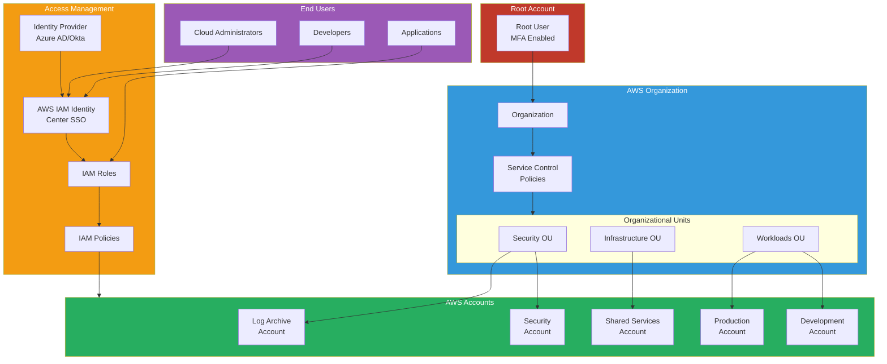

---

## Data Migration Architecture

### Database Migration Architecture

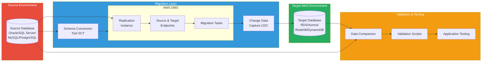

### Large-Scale Data Transfer Architecture

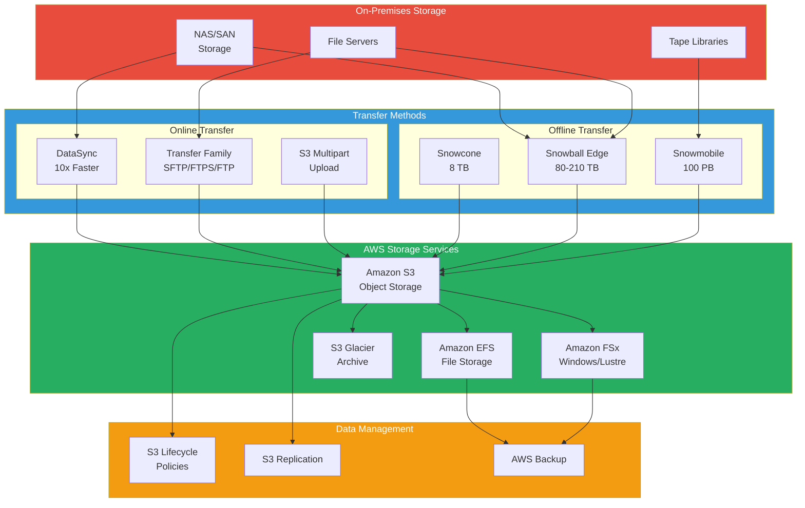

---

## Application Migration Architecture

### Server Migration with AWS MGN

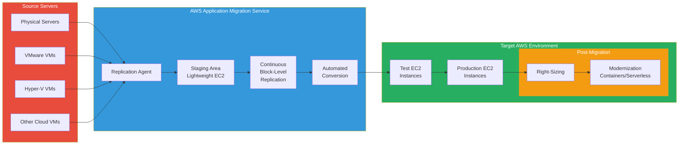

### Containerized Application Migration

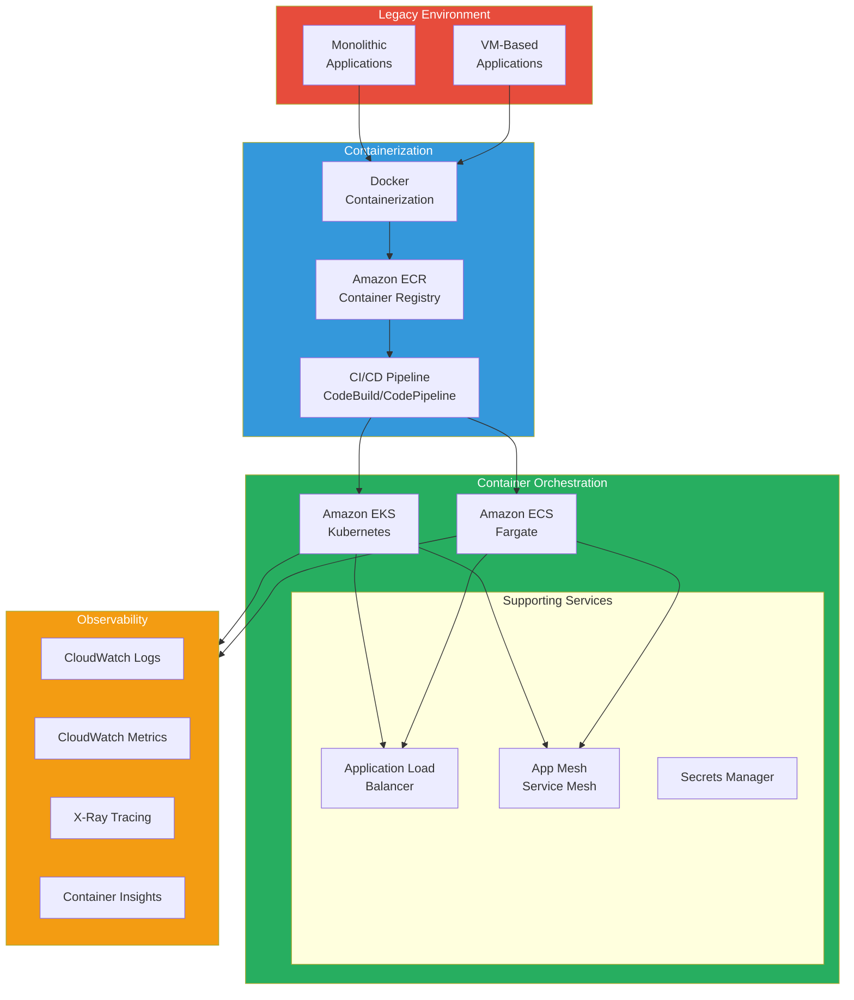

---

## Landing Zone Architecture

### AWS Control Tower Landing Zone

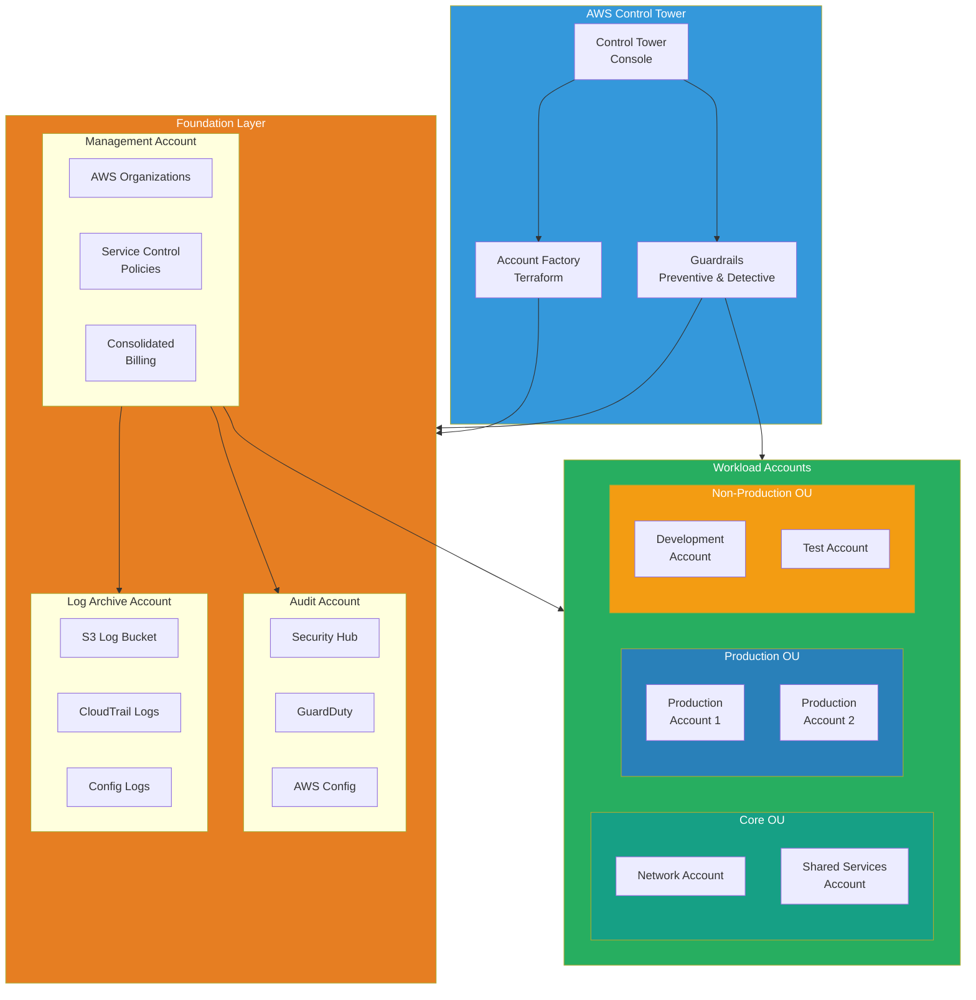

---

## Migration Hub Architecture

### Centralized Migration Tracking

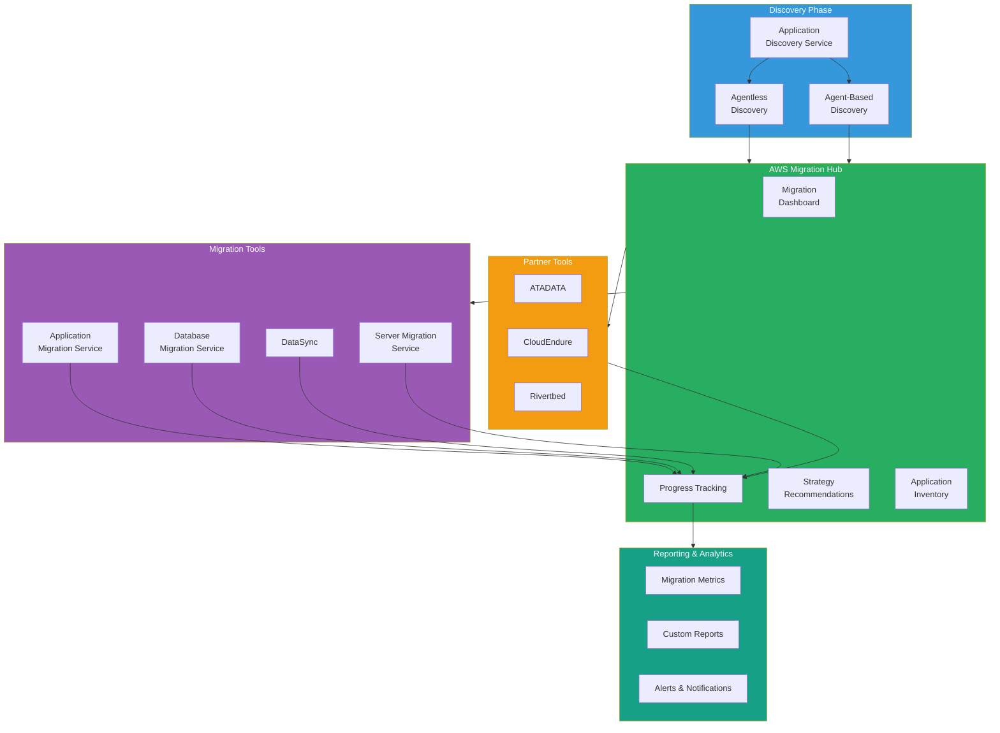

---

## Migration Wave Architecture

### Wave-Based Migration Approach

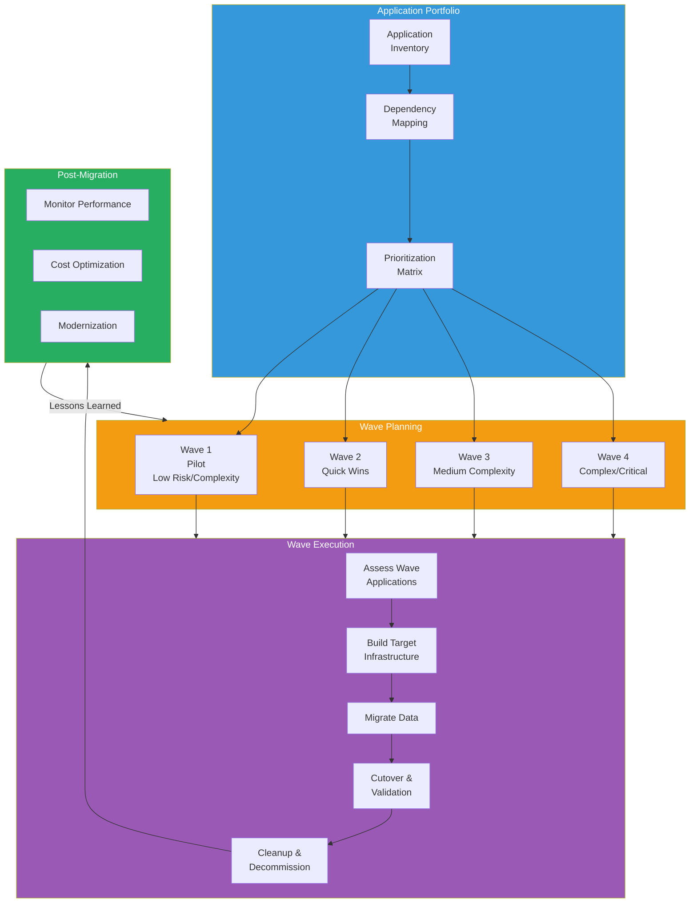

---

## Disaster Recovery Architecture

### Multi-Region DR Architecture

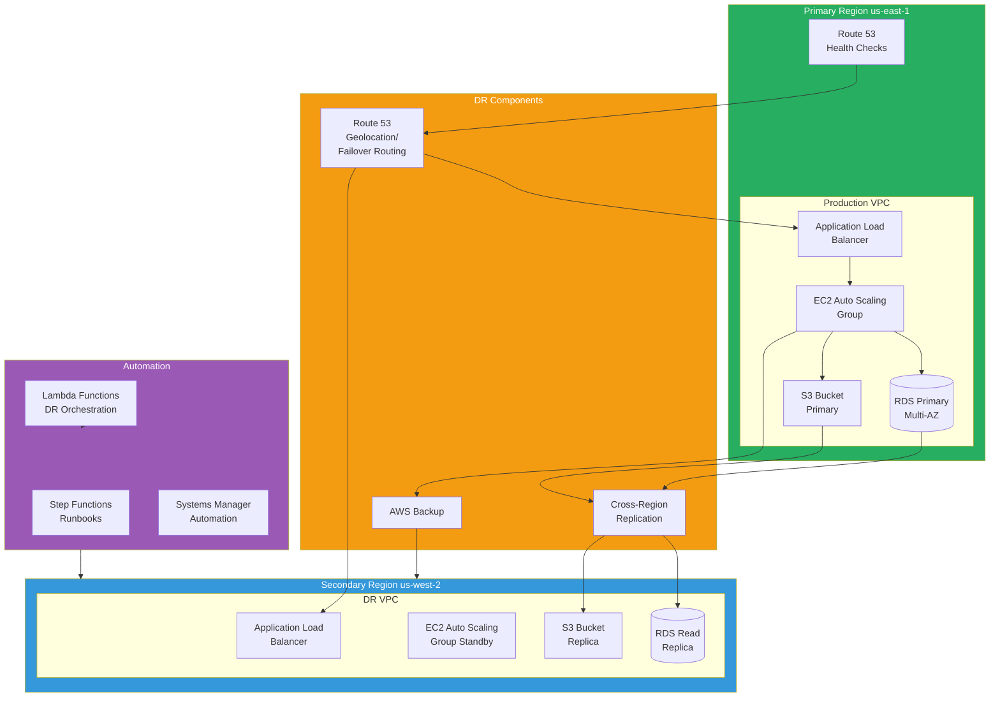

---

## Monitoring and Observability Architecture

### Comprehensive Monitoring Stack

```mermaid
graph TB
    subgraph Sources["Data Sources"]
        APPLICATIONS[Applications]
        INFRA[Infrastructure]
        DATABASES[Databases]
        NETWORK[Network]
    end
    
    subgraph Collection["Data Collection"]
        CW_AGENT[CloudWatch Agent]
        XRAY_AGENT[X-Ray Agent]
        FLUENT_BIT[Fluent Bit]
        OTEL[OpenTelemetry]
    end
    
    subgraph Storage["Centralized Storage"]
        CW_LOGS2[CloudWatch Logs]
        CW_METRICS2[CloudWatch Metrics]
        XRAY_TRACES[X-Ray Traces]
        S3_ARCHIVE[S3 Archive]
    end
    
    subgraph Analysis["Analysis & Visualization"]
        CW_INSIGHTS2[CloudWatch<br/>Insights]
        CW_DASHBOARDS[CloudWatch<br/>Dashboards]
        GRAFANA2[Amazon Managed<br/>Grafana]
        QUICKSIGHT[QuickSight]
    end
    
    subgraph Alerting["Alerting & Response"]
        CW_ALARMS[CloudWatch Alarms]
        SNS[SNS Topics]
        LAMBDA_ALERT[Lambda Functions]
        PAGERDUTY[PagerDuty/Opsgenie]
        EVENTBRIDGE[EventBridge Rules]
    end
    
    Sources --> Collection
    Collection --> Storage
    Storage --> Analysis
    Analysis --> Alerting
    
    style Sources fill:#3498db,color:#fff
    style Collection fill:#f39c12,color:#fff
    style Storage fill:#9b59b6,color:#fff
    style Analysis fill:#27ae60,color:#fff
    style Alerting fill:#e74c3c,color:#fff
```

---

## Key Architectural Principles

### 1. **High Availability**
- Deploy across multiple Availability Zones (AZs)
- Use Auto Scaling for compute resources
- Implement load balancing for traffic distribution
- Design for failure and automatic recovery

### 2. **Security**
- Implement defense-in-depth strategy
- Use least privilege access principles
- Enable encryption at rest and in transit
- Continuous security monitoring and compliance

### 3. **Scalability**
- Design for horizontal scaling
- Use managed services where possible
- Implement caching strategies
- Optimize database performance

### 4. **Cost Optimization**
- Right-size resources based on actual usage
- Use Reserved Instances and Savings Plans
- Implement auto-scaling to match demand
- Regular cost review and optimization

### 5. **Operational Excellence**
- Infrastructure as Code (IaC) for all resources
- Automated deployment pipelines
- Comprehensive monitoring and alerting
- Regular disaster recovery testing

---

## Architecture Decision Records (ADRs)

### Sample ADR Template

**Decision**: Use AWS Application Migration Service (MGN) for server migrations

**Context**: Need to migrate 500+ servers from on-premises VMware environment

**Options Considered**:
1. AWS MGN (Application Migration Service)
2. Manual migration with AMIs
3. Third-party migration tools

**Decision Rationale**:
- Minimal downtime with continuous replication
- Automated conversion and testing capabilities
- Native AWS integration
- Cost-effective compared to third-party tools

**Consequences**:
- Positive: Faster migration, less downtime, repeatable process
- Negative: Learning curve for teams, dependency on AWS service availability

---

## Best Practices Summary

1. **Start with Landing Zone**: Deploy AWS Control Tower before migrations
2. **Security First**: Implement security guardrails from day one
3. **Automate Everything**: Use IaC and automation for repeatability
4. **Monitor Continuously**: Implement comprehensive observability
5. **Plan for DR**: Design disaster recovery from the start
6. **Optimize Costs**: Regular review and optimization cycles
7. **Document Architecture**: Maintain up-to-date architecture diagrams
8. **Test Thoroughly**: Validate migrations in non-production first

---

## Additional Resources

- [AWS Well-Architected Framework](https://aws.amazon.com/architecture/well-architected/)
- [AWS Architecture Center](https://aws.amazon.com/architecture/)
- [AWS Reference Architecture Diagrams](https://aws.amazon.com/architecture/reference-architecture-diagrams/)
- [AWS Migration Hub](https://aws.amazon.com/migration-hub/)

---

*Document Version: 1.0*  
*Last Updated: November 12, 2025*  
*Maintained by: AWS Cloud Migration Team*
