# AWS Cloud Migration Sequence Diagrams

## Table of Contents

- [Overview](#overview)
- [Assessment Phase Workflows](#assessment-phase-workflows)
- [Mobilize Phase Workflows](#mobilize-phase-workflows)
- [Migration Phase Workflows](#migration-phase-workflows)
- [Data Migration Workflows](#data-migration-workflows)
- [Cutover and Validation Workflows](#cutover-and-validation-workflows)

---

## Overview

This document provides detailed sequence diagrams illustrating the step-by-step workflows for AWS cloud migration. These diagrams show the interactions between different AWS services, teams, and systems throughout the migration journey.

---

## Assessment Phase Workflows

### Portfolio Discovery and Assessment

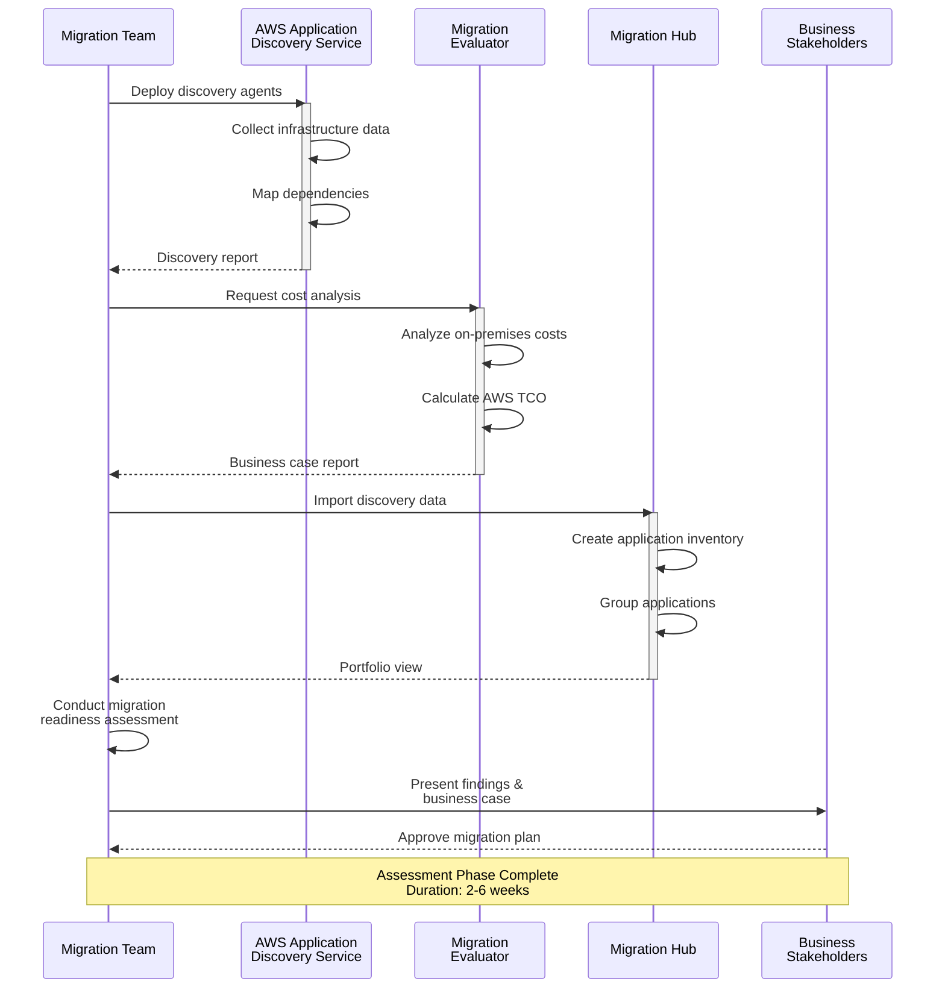
```mermaid
sequenceDiagram
    participant Team as Migration Team
    participant ADS as AWS Application<br/>Discovery Service
    participant ME as Migration<br/>Evaluator
    participant Hub as Migration Hub
    participant Stakeholders as Business<br/>Stakeholders
    
    Team->>ADS: Deploy discovery agents
    activate ADS
    ADS->>ADS: Collect infrastructure data
    ADS->>ADS: Map dependencies
    ADS-->>Team: Discovery report
    deactivate ADS
    
    Team->>ME: Request cost analysis
    activate ME
    ME->>ME: Analyze on-premises costs
    ME->>ME: Calculate AWS TCO
    ME-->>Team: Business case report
    deactivate ME
    
    Team->>Hub: Import discovery data
    activate Hub
    Hub->>Hub: Create application inventory
    Hub->>Hub: Group applications
    Hub-->>Team: Portfolio view
    deactivate Hub
    
    Team->>Team: Conduct migration<br/>readiness assessment
    Team->>Stakeholders: Present findings &<br/>business case
    Stakeholders-->>Team: Approve migration plan
    
    Note over Team,Stakeholders: Assessment Phase Complete<br/>Duration: 2-6 weeks
```

### Application Dependency Mapping

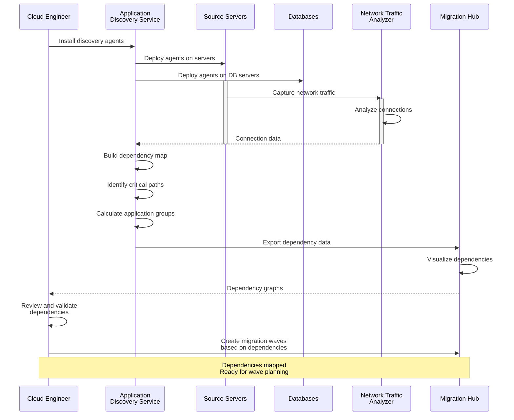
```mermaid
sequenceDiagram
    participant Engineer as Cloud Engineer
    participant ADS as Application<br/>Discovery Service
    participant Server as Source Servers
    participant DB as Databases
    participant Network as Network Traffic<br/>Analyzer
    participant Hub as Migration Hub
    
    Engineer->>ADS: Install discovery agents
    ADS->>Server: Deploy agents on servers
    ADS->>DB: Deploy agents on DB servers
    
    activate Server
    Server->>Network: Capture network traffic
    activate Network
    Network->>Network: Analyze connections
    Network-->>ADS: Connection data
    deactivate Network
    deactivate Server
    
    ADS->>ADS: Build dependency map
    ADS->>ADS: Identify critical paths
    ADS->>ADS: Calculate application groups
    
    ADS->>Hub: Export dependency data
    Hub->>Hub: Visualize dependencies
    Hub-->>Engineer: Dependency graphs
    
    Engineer->>Engineer: Review and validate<br/>dependencies
    Engineer->>Hub: Create migration waves<br/>based on dependencies
    
    Note over Engineer,Hub: Dependencies mapped<br/>Ready for wave planning
```

### Migration Readiness Assessment (MRA)

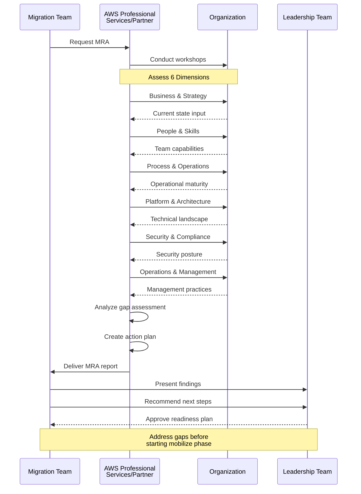
```mermaid
sequenceDiagram
    participant Team as Migration Team
    participant AWS as AWS Professional<br/>Services/Partner
    participant Org as Organization
    participant Leadership as Leadership Team
    
    Team->>AWS: Request MRA
    AWS->>Org: Conduct workshops
    
    Note over AWS,Org: Assess 6 Dimensions
    
    AWS->>Org: Business & Strategy
    Org-->>AWS: Current state input
    
    AWS->>Org: People & Skills
    Org-->>AWS: Team capabilities
    
    AWS->>Org: Process & Operations
    Org-->>AWS: Operational maturity
    
    AWS->>Org: Platform & Architecture
    Org-->>AWS: Technical landscape
    
    AWS->>Org: Security & Compliance
    Org-->>AWS: Security posture
    
    AWS->>Org: Operations & Management
    Org-->>AWS: Management practices
    
    AWS->>AWS: Analyze gap assessment
    AWS->>AWS: Create action plan
    AWS->>Team: Deliver MRA report
    
    Team->>Leadership: Present findings
    Team->>Leadership: Recommend next steps
    Leadership-->>Team: Approve readiness plan
    
    Note over Team,Leadership: Address gaps before<br/>starting mobilize phase
```

---

## Mobilize Phase Workflows

### Landing Zone Setup with AWS Control Tower

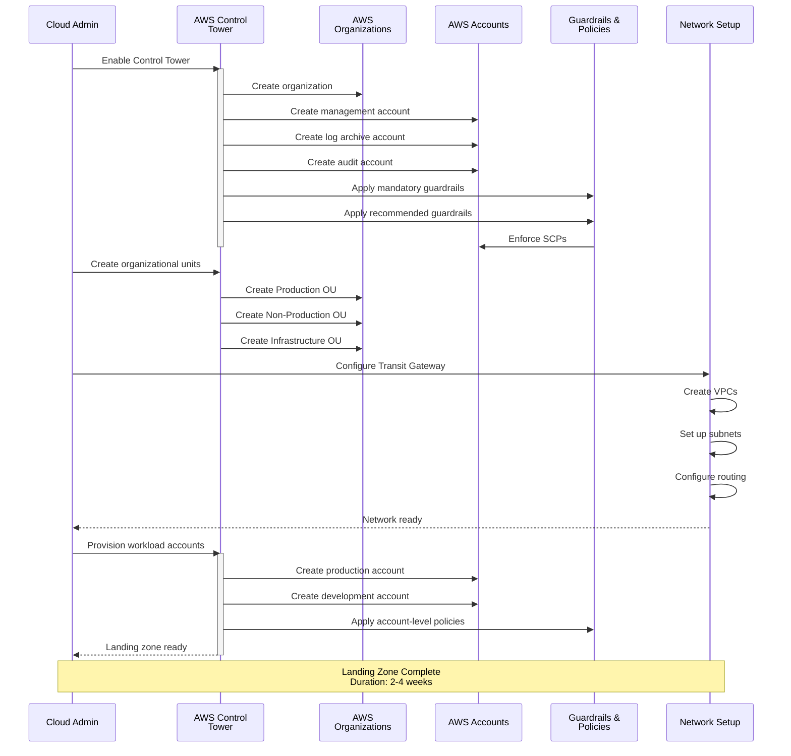
```mermaid
sequenceDiagram
    participant Admin as Cloud Admin
    participant CT as AWS Control<br/>Tower
    participant Org as AWS<br/>Organizations
    participant Accounts as AWS Accounts
    participant Guardrails as Guardrails &<br/>Policies
    participant Network as Network Setup
    
    Admin->>CT: Enable Control Tower
    activate CT
    CT->>Org: Create organization
    CT->>Accounts: Create management account
    CT->>Accounts: Create log archive account
    CT->>Accounts: Create audit account
    
    CT->>Guardrails: Apply mandatory guardrails
    CT->>Guardrails: Apply recommended guardrails
    Guardrails->>Accounts: Enforce SCPs
    
    deactivate CT
    
    Admin->>CT: Create organizational units
    CT->>Org: Create Production OU
    CT->>Org: Create Non-Production OU
    CT->>Org: Create Infrastructure OU
    
    Admin->>Network: Configure Transit Gateway
    Network->>Network: Create VPCs
    Network->>Network: Set up subnets
    Network->>Network: Configure routing
    Network-->>Admin: Network ready
    
    Admin->>CT: Provision workload accounts
    activate CT
    CT->>Accounts: Create production account
    CT->>Accounts: Create development account
    CT->>Guardrails: Apply account-level policies
    CT-->>Admin: Landing zone ready
    deactivate CT
    
    Note over Admin,Network: Landing Zone Complete<br/>Duration: 2-4 weeks
```

### Wave Planning and Prioritization

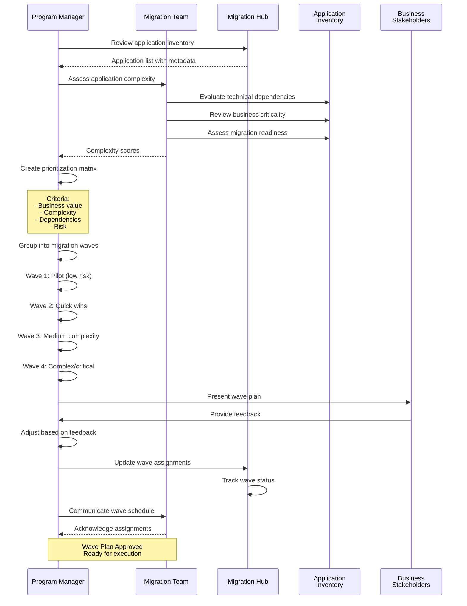
```mermaid
sequenceDiagram
    participant PM as Program Manager
    participant Team as Migration Team
    participant Hub as Migration Hub
    participant Apps as Application<br/>Inventory
    participant Stakeholders as Business<br/>Stakeholders
    
    PM->>Hub: Review application inventory
    Hub-->>PM: Application list with metadata
    
    PM->>Team: Assess application complexity
    Team->>Apps: Evaluate technical dependencies
    Team->>Apps: Review business criticality
    Team->>Apps: Assess migration readiness
    Team-->>PM: Complexity scores
    
    PM->>PM: Create prioritization matrix
    Note over PM: Criteria:<br/>- Business value<br/>- Complexity<br/>- Dependencies<br/>- Risk
    
    PM->>PM: Group into migration waves
    PM->>PM: Wave 1: Pilot (low risk)
    PM->>PM: Wave 2: Quick wins
    PM->>PM: Wave 3: Medium complexity
    PM->>PM: Wave 4: Complex/critical
    
    PM->>Stakeholders: Present wave plan
    Stakeholders->>PM: Provide feedback
    PM->>PM: Adjust based on feedback
    
    PM->>Hub: Update wave assignments
    Hub->>Hub: Track wave status
    
    PM->>Team: Communicate wave schedule
    Team-->>PM: Acknowledge assignments
    
    Note over PM,Team: Wave Plan Approved<br/>Ready for execution
```

### Team Training and Skill Building

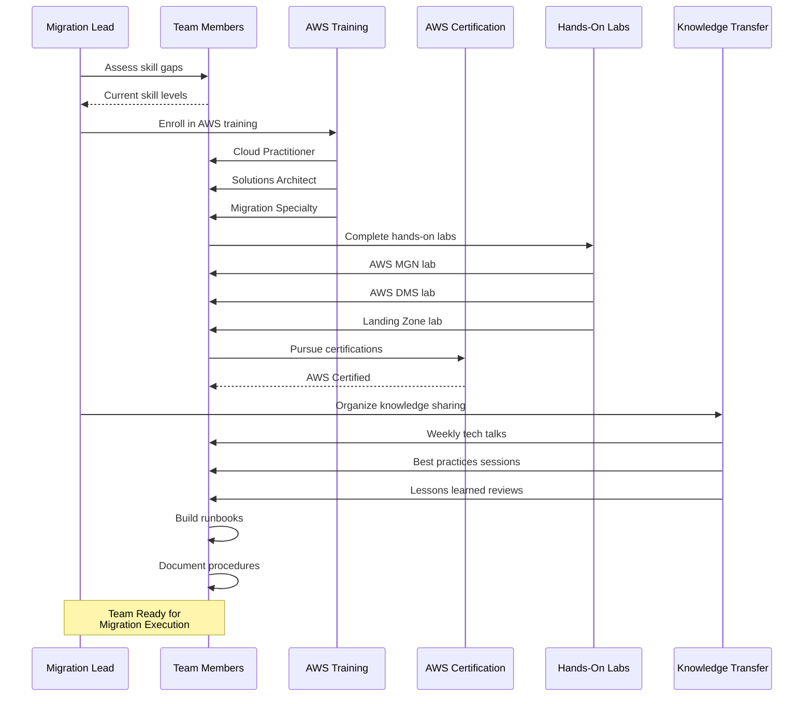
```mermaid
sequenceDiagram
    participant Lead as Migration Lead
    participant Team as Team Members
    participant AWS_Train as AWS Training
    participant Cert as AWS Certification
    participant Hands_On as Hands-On Labs
    participant KT as Knowledge Transfer
    
    Lead->>Team: Assess skill gaps
    Team-->>Lead: Current skill levels
    
    Lead->>AWS_Train: Enroll in AWS training
    AWS_Train->>Team: Cloud Practitioner
    AWS_Train->>Team: Solutions Architect
    AWS_Train->>Team: Migration Specialty
    
    Team->>Hands_On: Complete hands-on labs
    Hands_On->>Team: AWS MGN lab
    Hands_On->>Team: AWS DMS lab
    Hands_On->>Team: Landing Zone lab
    
    Team->>Cert: Pursue certifications
    Cert-->>Team: AWS Certified
    
    Lead->>KT: Organize knowledge sharing
    KT->>Team: Weekly tech talks
    KT->>Team: Best practices sessions
    KT->>Team: Lessons learned reviews
    
    Team->>Team: Build runbooks
    Team->>Team: Document procedures
    
    Note over Lead,Team: Team Ready for<br/>Migration Execution
```

---

## Migration Phase Workflows

### Server Migration with AWS Application Migration Service (MGN)

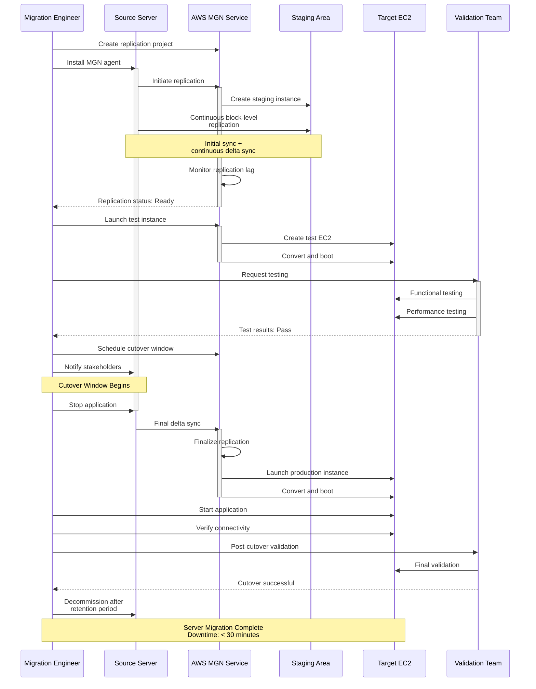
```mermaid
sequenceDiagram
    participant Engineer as Migration Engineer
    participant Source as Source Server
    participant MGN as AWS MGN Service
    participant Staging as Staging Area
    participant Target as Target EC2
    participant Validation as Validation Team
    
    Engineer->>MGN: Create replication project
    Engineer->>Source: Install MGN agent
    
    activate Source
    Source->>MGN: Initiate replication
    activate MGN
    MGN->>Staging: Create staging instance
    
    Source->>Staging: Continuous block-level<br/>replication
    Note over Source,Staging: Initial sync +<br/>continuous delta sync
    
    MGN->>MGN: Monitor replication lag
    MGN-->>Engineer: Replication status: Ready
    deactivate MGN
    
    Engineer->>MGN: Launch test instance
    activate MGN
    MGN->>Target: Create test EC2
    MGN->>Target: Convert and boot
    deactivate MGN
    
    Engineer->>Validation: Request testing
    activate Validation
    Validation->>Target: Functional testing
    Validation->>Target: Performance testing
    Validation-->>Engineer: Test results: Pass
    deactivate Validation
    
    Engineer->>MGN: Schedule cutover window
    Engineer->>Source: Notify stakeholders
    
    Note over Engineer,Source: Cutover Window Begins
    
    Engineer->>Source: Stop application
    deactivate Source
    Source->>MGN: Final delta sync
    
    activate MGN
    MGN->>MGN: Finalize replication
    MGN->>Target: Launch production instance
    MGN->>Target: Convert and boot
    deactivate MGN
    
    Engineer->>Target: Start application
    Engineer->>Target: Verify connectivity
    Engineer->>Validation: Post-cutover validation
    
    Validation->>Target: Final validation
    Validation-->>Engineer: Cutover successful
    
    Engineer->>Source: Decommission after<br/>retention period
    
    Note over Engineer,Target: Server Migration Complete<br/>Downtime: < 30 minutes
```

### Database Migration with AWS DMS

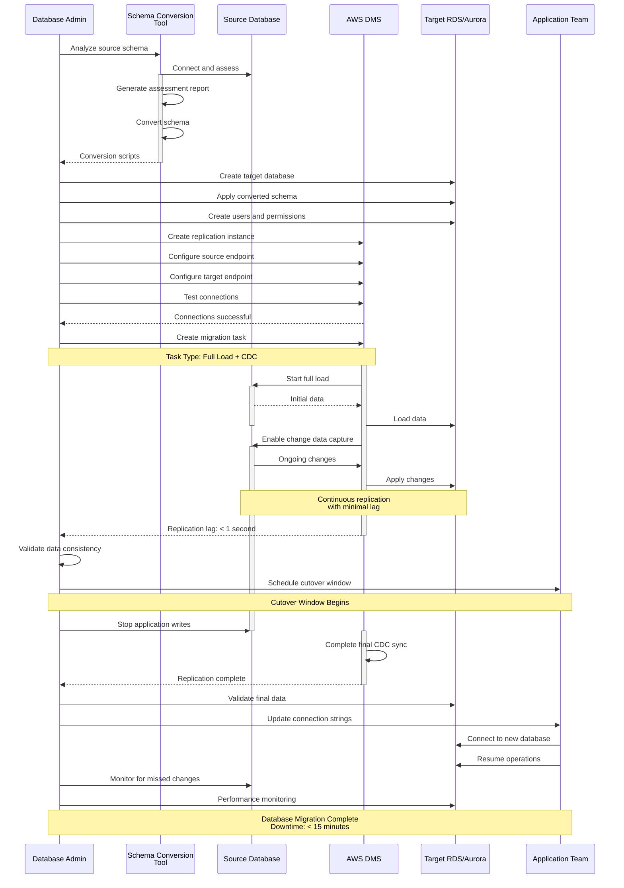
```mermaid
sequenceDiagram
    participant DBA as Database Admin
    participant SCT as Schema Conversion<br/>Tool
    participant Source_DB as Source Database
    participant DMS as AWS DMS
    participant Target_DB as Target RDS/Aurora
    participant App as Application Team
    
    DBA->>SCT: Analyze source schema
    SCT->>Source_DB: Connect and assess
    activate SCT
    SCT->>SCT: Generate assessment report
    SCT->>SCT: Convert schema
    SCT-->>DBA: Conversion scripts
    deactivate SCT
    
    DBA->>Target_DB: Create target database
    DBA->>Target_DB: Apply converted schema
    DBA->>Target_DB: Create users and permissions
    
    DBA->>DMS: Create replication instance
    DBA->>DMS: Configure source endpoint
    DBA->>DMS: Configure target endpoint
    DBA->>DMS: Test connections
    DMS-->>DBA: Connections successful
    
    DBA->>DMS: Create migration task
    Note over DBA,DMS: Task Type: Full Load + CDC
    
    activate DMS
    DMS->>Source_DB: Start full load
    activate Source_DB
    Source_DB-->>DMS: Initial data
    DMS->>Target_DB: Load data
    deactivate Source_DB
    
    DMS->>Source_DB: Enable change data capture
    activate Source_DB
    Source_DB->>DMS: Ongoing changes
    DMS->>Target_DB: Apply changes
    Note over Source_DB,Target_DB: Continuous replication<br/>with minimal lag
    
    DMS-->>DBA: Replication lag: < 1 second
    deactivate DMS
    
    DBA->>DBA: Validate data consistency
    DBA->>App: Schedule cutover window
    
    Note over DBA,App: Cutover Window Begins
    
    DBA->>Source_DB: Stop application writes
    deactivate Source_DB
    
    activate DMS
    DMS->>DMS: Complete final CDC sync
    DMS-->>DBA: Replication complete
    deactivate DMS
    
    DBA->>Target_DB: Validate final data
    DBA->>App: Update connection strings
    App->>Target_DB: Connect to new database
    App->>Target_DB: Resume operations
    
    DBA->>Source_DB: Monitor for missed changes
    DBA->>Target_DB: Performance monitoring
    
    Note over DBA,App: Database Migration Complete<br/>Downtime: < 15 minutes
```

### Containerized Application Migration

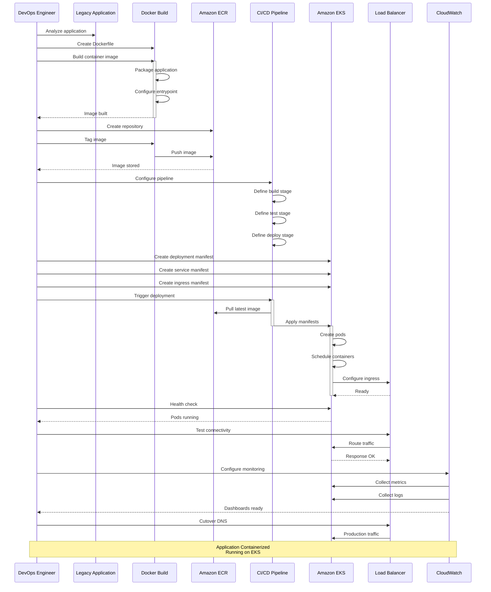
```mermaid
sequenceDiagram
    participant DevOps as DevOps Engineer
    participant Source as Legacy Application
    participant Docker as Docker Build
    participant ECR as Amazon ECR
    participant CI_CD as CI/CD Pipeline
    participant EKS as Amazon EKS
    participant LB as Load Balancer
    participant Monitor as CloudWatch
    
    DevOps->>Source: Analyze application
    DevOps->>Docker: Create Dockerfile
    DevOps->>Docker: Build container image
    
    activate Docker
    Docker->>Docker: Package application
    Docker->>Docker: Configure entrypoint
    Docker-->>DevOps: Image built
    deactivate Docker
    
    DevOps->>ECR: Create repository
    DevOps->>Docker: Tag image
    Docker->>ECR: Push image
    ECR-->>DevOps: Image stored
    
    DevOps->>CI_CD: Configure pipeline
    CI_CD->>CI_CD: Define build stage
    CI_CD->>CI_CD: Define test stage
    CI_CD->>CI_CD: Define deploy stage
    
    DevOps->>EKS: Create deployment manifest
    DevOps->>EKS: Create service manifest
    DevOps->>EKS: Create ingress manifest
    
    DevOps->>CI_CD: Trigger deployment
    activate CI_CD
    CI_CD->>ECR: Pull latest image
    CI_CD->>EKS: Apply manifests
    deactivate CI_CD
    
    activate EKS
    EKS->>EKS: Create pods
    EKS->>EKS: Schedule containers
    EKS->>LB: Configure ingress
    LB-->>EKS: Ready
    deactivate EKS
    
    DevOps->>EKS: Health check
    EKS-->>DevOps: Pods running
    
    DevOps->>LB: Test connectivity
    LB->>EKS: Route traffic
    EKS-->>LB: Response OK
    
    DevOps->>Monitor: Configure monitoring
    Monitor->>EKS: Collect metrics
    Monitor->>EKS: Collect logs
    Monitor-->>DevOps: Dashboards ready
    
    DevOps->>LB: Cutover DNS
    LB->>EKS: Production traffic
    
    Note over DevOps,Monitor: Application Containerized<br/>Running on EKS
```

---

## Data Migration Workflows

### Large File Transfer with AWS DataSync

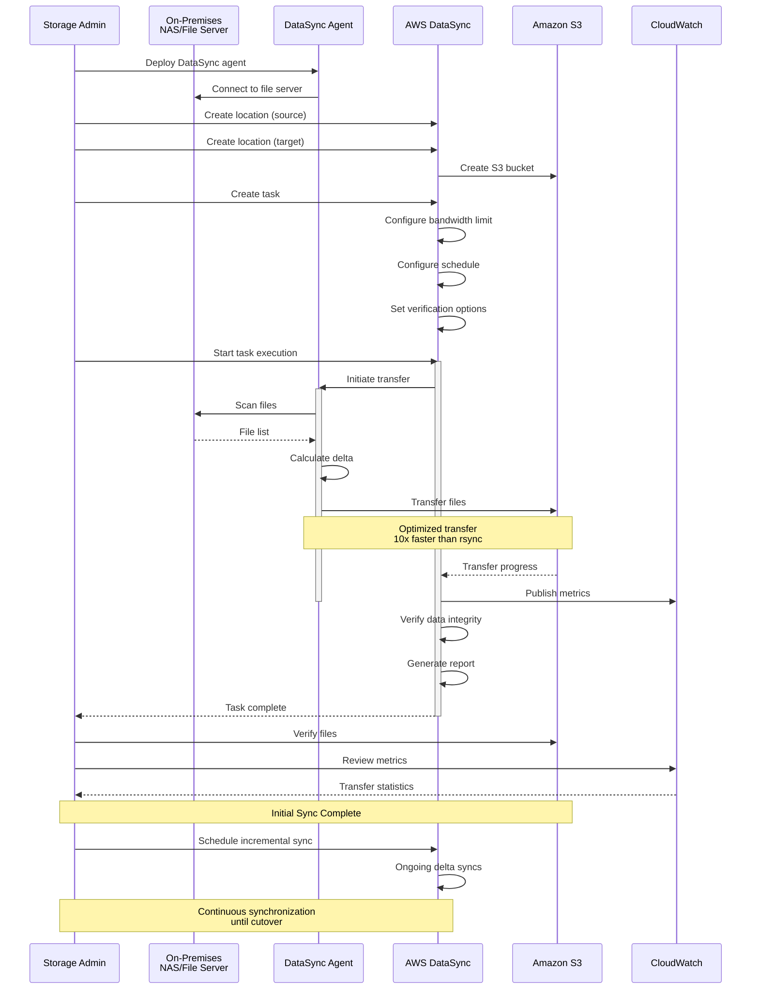
```mermaid
sequenceDiagram
    participant Admin as Storage Admin
    participant OnPrem as On-Premises<br/>NAS/File Server
    participant Agent as DataSync Agent
    participant DataSync as AWS DataSync
    participant S3 as Amazon S3
    participant Monitor as CloudWatch
    
    Admin->>Agent: Deploy DataSync agent
    Agent->>OnPrem: Connect to file server
    
    Admin->>DataSync: Create location (source)
    Admin->>DataSync: Create location (target)
    DataSync->>S3: Create S3 bucket
    
    Admin->>DataSync: Create task
    DataSync->>DataSync: Configure bandwidth limit
    DataSync->>DataSync: Configure schedule
    DataSync->>DataSync: Set verification options
    
    Admin->>DataSync: Start task execution
    activate DataSync
    DataSync->>Agent: Initiate transfer
    
    activate Agent
    Agent->>OnPrem: Scan files
    OnPrem-->>Agent: File list
    
    Agent->>Agent: Calculate delta
    Agent->>S3: Transfer files
    Note over Agent,S3: Optimized transfer<br/>10x faster than rsync
    
    S3-->>DataSync: Transfer progress
    DataSync->>Monitor: Publish metrics
    deactivate Agent
    
    DataSync->>DataSync: Verify data integrity
    DataSync->>DataSync: Generate report
    DataSync-->>Admin: Task complete
    deactivate DataSync
    
    Admin->>S3: Verify files
    Admin->>Monitor: Review metrics
    Monitor-->>Admin: Transfer statistics
    
    Note over Admin,S3: Initial Sync Complete
    
    Admin->>DataSync: Schedule incremental sync
    DataSync->>DataSync: Ongoing delta syncs
    
    Note over Admin,DataSync: Continuous synchronization<br/>until cutover
```

### Offline Data Migration with AWS Snowball

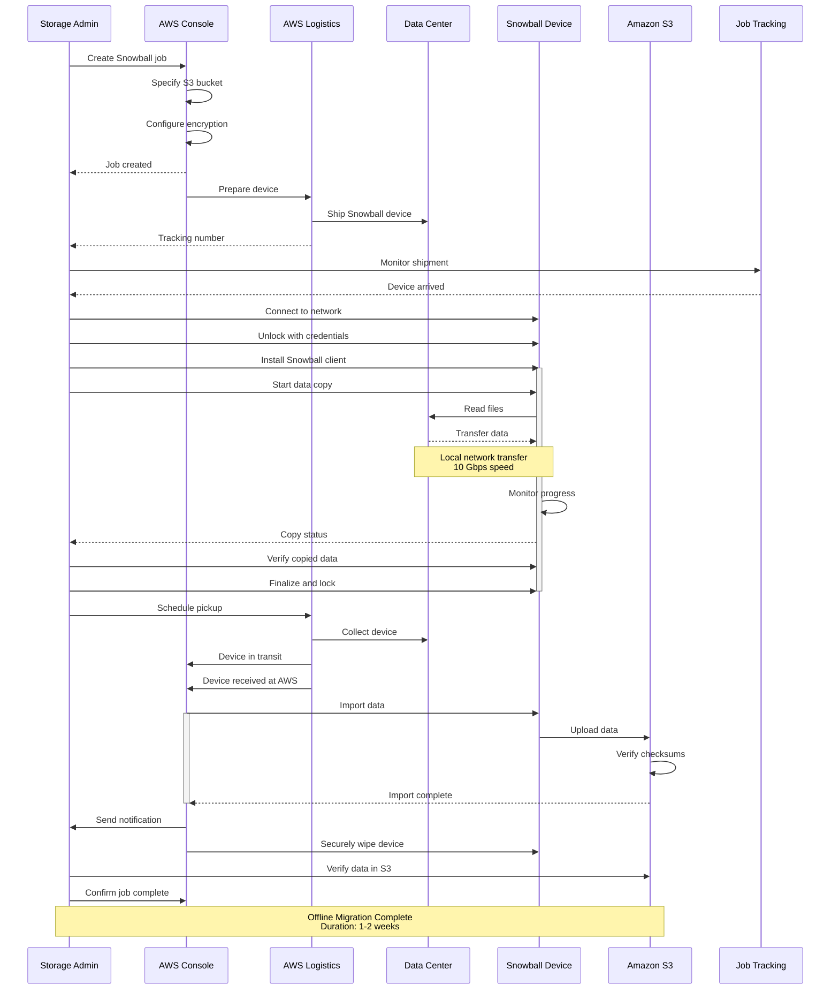
```mermaid
sequenceDiagram
    participant Admin as Storage Admin
    participant AWS_Console as AWS Console
    participant Logistics as AWS Logistics
    participant OnPrem as Data Center
    participant Snowball as Snowball Device
    participant S3 as Amazon S3
    participant Tracking as Job Tracking
    
    Admin->>AWS_Console: Create Snowball job
    AWS_Console->>AWS_Console: Specify S3 bucket
    AWS_Console->>AWS_Console: Configure encryption
    AWS_Console-->>Admin: Job created
    
    AWS_Console->>Logistics: Prepare device
    Logistics->>OnPrem: Ship Snowball device
    Logistics-->>Admin: Tracking number
    
    Admin->>Tracking: Monitor shipment
    Tracking-->>Admin: Device arrived
    
    Admin->>Snowball: Connect to network
    Admin->>Snowball: Unlock with credentials
    Admin->>Snowball: Install Snowball client
    
    activate Snowball
    Admin->>Snowball: Start data copy
    Snowball->>OnPrem: Read files
    OnPrem-->>Snowball: Transfer data
    Note over Snowball,OnPrem: Local network transfer<br/>10 Gbps speed
    
    Snowball->>Snowball: Monitor progress
    Snowball-->>Admin: Copy status
    
    Admin->>Snowball: Verify copied data
    Admin->>Snowball: Finalize and lock
    deactivate Snowball
    
    Admin->>Logistics: Schedule pickup
    Logistics->>OnPrem: Collect device
    Logistics->>AWS_Console: Device in transit
    
    Logistics->>AWS_Console: Device received at AWS
    AWS_Console->>Snowball: Import data
    
    activate AWS_Console
    Snowball->>S3: Upload data
    S3->>S3: Verify checksums
    S3-->>AWS_Console: Import complete
    deactivate AWS_Console
    
    AWS_Console->>Admin: Send notification
    AWS_Console->>Snowball: Securely wipe device
    
    Admin->>S3: Verify data in S3
    Admin->>AWS_Console: Confirm job complete
    
    Note over Admin,S3: Offline Migration Complete<br/>Duration: 1-2 weeks
```

---

## Cutover and Validation Workflows

### Production Cutover Process

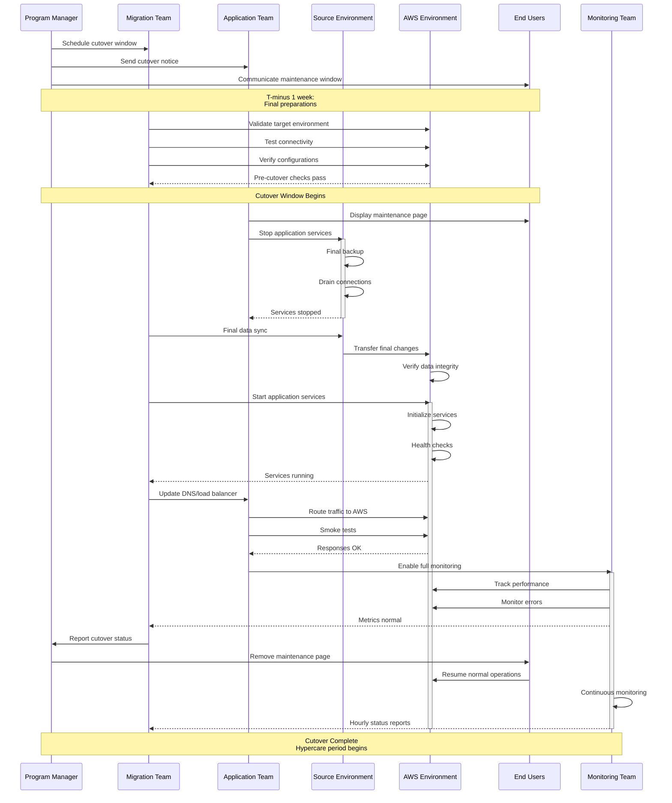
```mermaid
sequenceDiagram
    participant PM as Program Manager
    participant Team as Migration Team
    participant App as Application Team
    participant Source as Source Environment
    participant AWS as AWS Environment
    participant Users as End Users
    participant Monitor as Monitoring Team
    
    PM->>Team: Schedule cutover window
    PM->>App: Send cutover notice
    PM->>Users: Communicate maintenance window
    
    Note over PM,Users: T-minus 1 week:<br/>Final preparations
    
    Team->>AWS: Validate target environment
    Team->>AWS: Test connectivity
    Team->>AWS: Verify configurations
    AWS-->>Team: Pre-cutover checks pass
    
    Note over PM,Users: Cutover Window Begins
    
    App->>Users: Display maintenance page
    App->>Source: Stop application services
    activate Source
    Source->>Source: Final backup
    Source->>Source: Drain connections
    Source-->>App: Services stopped
    deactivate Source
    
    Team->>Source: Final data sync
    Source->>AWS: Transfer final changes
    AWS->>AWS: Verify data integrity
    
    Team->>AWS: Start application services
    activate AWS
    AWS->>AWS: Initialize services
    AWS->>AWS: Health checks
    AWS-->>Team: Services running
    
    Team->>App: Update DNS/load balancer
    App->>AWS: Route traffic to AWS
    
    App->>AWS: Smoke tests
    AWS-->>App: Responses OK
    
    App->>Monitor: Enable full monitoring
    activate Monitor
    Monitor->>AWS: Track performance
    Monitor->>AWS: Monitor errors
    Monitor-->>Team: Metrics normal
    
    Team->>PM: Report cutover status
    PM->>Users: Remove maintenance page
    Users->>AWS: Resume normal operations
    
    Monitor->>Monitor: Continuous monitoring
    Monitor-->>Team: Hourly status reports
    deactivate Monitor
    deactivate AWS
    
    Note over PM,Monitor: Cutover Complete<br/>Hypercare period begins
```

### Post-Migration Validation

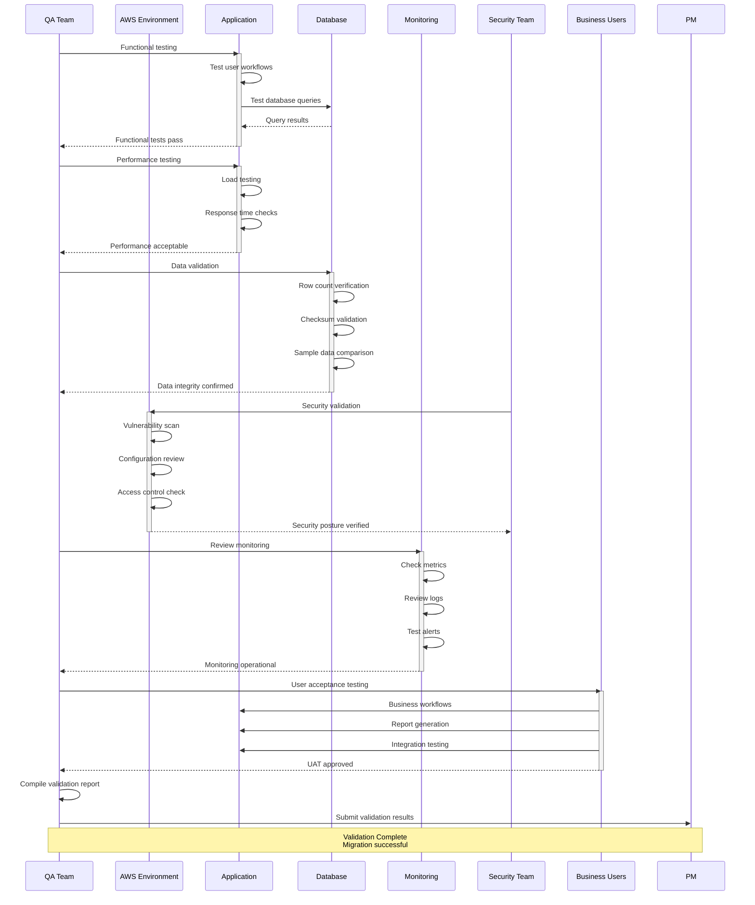
```mermaid
sequenceDiagram
    participant QA as QA Team
    participant AWS as AWS Environment
    participant App as Application
    participant DB as Database
    participant Monitor as Monitoring
    participant Security as Security Team
    participant Users as Business Users
    
    QA->>App: Functional testing
    activate App
    App->>App: Test user workflows
    App->>DB: Test database queries
    DB-->>App: Query results
    App-->>QA: Functional tests pass
    deactivate App
    
    QA->>App: Performance testing
    activate App
    App->>App: Load testing
    App->>App: Response time checks
    App-->>QA: Performance acceptable
    deactivate App
    
    QA->>DB: Data validation
    activate DB
    DB->>DB: Row count verification
    DB->>DB: Checksum validation
    DB->>DB: Sample data comparison
    DB-->>QA: Data integrity confirmed
    deactivate DB
    
    Security->>AWS: Security validation
    activate AWS
    AWS->>AWS: Vulnerability scan
    AWS->>AWS: Configuration review
    AWS->>AWS: Access control check
    AWS-->>Security: Security posture verified
    deactivate AWS
    
    QA->>Monitor: Review monitoring
    activate Monitor
    Monitor->>Monitor: Check metrics
    Monitor->>Monitor: Review logs
    Monitor->>Monitor: Test alerts
    Monitor-->>QA: Monitoring operational
    deactivate Monitor
    
    QA->>Users: User acceptance testing
    activate Users
    Users->>App: Business workflows
    Users->>App: Report generation
    Users->>App: Integration testing
    Users-->>QA: UAT approved
    deactivate Users
    
    QA->>QA: Compile validation report
    QA->>PM: Submit validation results
    
    Note over QA,PM: Validation Complete<br/>Migration successful
```

### Rollback Procedure

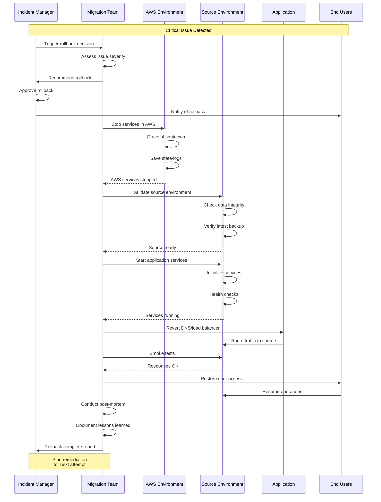
```mermaid
sequenceDiagram
    participant Incident as Incident Manager
    participant Team as Migration Team
    participant AWS as AWS Environment
    participant Source as Source Environment
    participant App as Application
    participant Users as End Users
    
    Note over Incident,Users: Critical Issue Detected
    
    Incident->>Team: Trigger rollback decision
    Team->>Team: Assess issue severity
    Team->>Incident: Recommend rollback
    Incident->>Incident: Approve rollback
    
    Incident->>Users: Notify of rollback
    
    Team->>AWS: Stop services in AWS
    activate AWS
    AWS->>AWS: Graceful shutdown
    AWS->>AWS: Save state/logs
    AWS-->>Team: AWS services stopped
    deactivate AWS
    
    Team->>Source: Validate source environment
    activate Source
    Source->>Source: Check data integrity
    Source->>Source: Verify latest backup
    Source-->>Team: Source ready
    
    Team->>Source: Start application services
    Source->>Source: Initialize services
    Source->>Source: Health checks
    Source-->>Team: Services running
    deactivate Source
    
    Team->>App: Revert DNS/load balancer
    App->>Source: Route traffic to source
    
    Team->>Source: Smoke tests
    Source-->>Team: Responses OK
    
    Team->>Users: Restore user access
    Users->>Source: Resume operations
    
    Team->>Team: Conduct post-mortem
    Team->>Team: Document lessons learned
    Team->>Incident: Rollback complete report
    
    Note over Incident,Team: Plan remediation<br/>for next attempt
```

---

## Optimization and Modernization Workflows

### Post-Migration Optimization

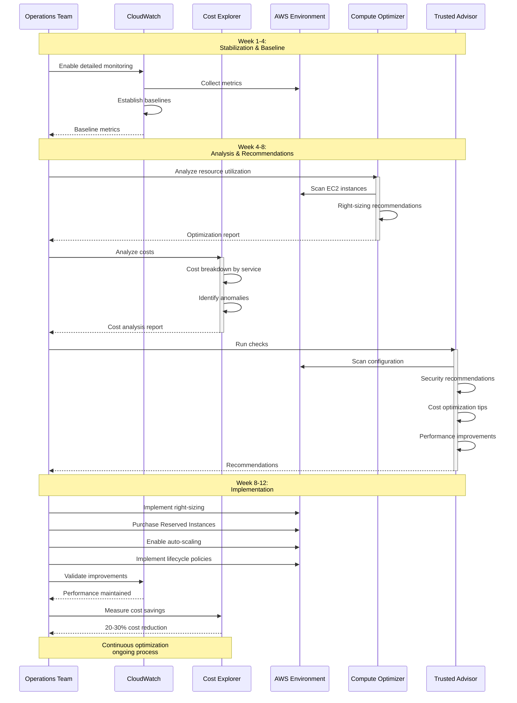
```mermaid
sequenceDiagram
    participant Ops as Operations Team
    participant CW as CloudWatch
    participant CE as Cost Explorer
    participant AWS_Env as AWS Environment
    participant Compute as Compute Optimizer
    participant Trusted as Trusted Advisor
    
    Note over Ops,Trusted: Week 1-4:<br/>Stabilization & Baseline
    
    Ops->>CW: Enable detailed monitoring
    CW->>AWS_Env: Collect metrics
    CW->>CW: Establish baselines
    CW-->>Ops: Baseline metrics
    
    Note over Ops,Trusted: Week 4-8:<br/>Analysis & Recommendations
    
    Ops->>Compute: Analyze resource utilization
    activate Compute
    Compute->>AWS_Env: Scan EC2 instances
    Compute->>Compute: Right-sizing recommendations
    Compute-->>Ops: Optimization report
    deactivate Compute
    
    Ops->>CE: Analyze costs
    activate CE
    CE->>CE: Cost breakdown by service
    CE->>CE: Identify anomalies
    CE-->>Ops: Cost analysis report
    deactivate CE
    
    Ops->>Trusted: Run checks
    activate Trusted
    Trusted->>AWS_Env: Scan configuration
    Trusted->>Trusted: Security recommendations
    Trusted->>Trusted: Cost optimization tips
    Trusted->>Trusted: Performance improvements
    Trusted-->>Ops: Recommendations
    deactivate Trusted
    
    Note over Ops,Trusted: Week 8-12:<br/>Implementation
    
    Ops->>AWS_Env: Implement right-sizing
    Ops->>AWS_Env: Purchase Reserved Instances
    Ops->>AWS_Env: Enable auto-scaling
    Ops->>AWS_Env: Implement lifecycle policies
    
    Ops->>CW: Validate improvements
    CW-->>Ops: Performance maintained
    
    Ops->>CE: Measure cost savings
    CE-->>Ops: 20-30% cost reduction
    
    Note over Ops,CE: Continuous optimization<br/>ongoing process
```

---

## Key Takeaways

### Workflow Best Practices

1. **Clear Communication**: Maintain open communication channels throughout all workflows
2. **Validation at Every Step**: Validate before proceeding to the next phase
3. **Documentation**: Document every workflow execution for repeatability
4. **Automation**: Automate repetitive tasks using scripts and tools
5. **Rollback Plans**: Always have a tested rollback procedure ready
6. **Monitoring**: Implement comprehensive monitoring before cutover
7. **Testing**: Test thoroughly in non-production environments first
8. **Stakeholder Updates**: Provide regular status updates to all stakeholders

### Timeline Summary

| Phase | Duration | Key Milestones |
|-------|----------|----------------|
| Assessment | 2-6 weeks | Discovery complete, business case approved |
| Mobilize | 4-12 weeks | Landing zone ready, teams trained |
| Pilot Migration | 2-4 weeks | First wave successful, runbooks validated |
| Full Migration | 3-18+ months | All waves complete, applications optimized |

---

## Additional Resources

- [AWS Migration Hub Documentation](https://docs.aws.amazon.com/migrationhub/)
- [AWS Application Migration Service Guide](https://docs.aws.amazon.com/mgn/)
- [AWS Database Migration Service Best Practices](https://docs.aws.amazon.com/dms/)
- [AWS Cloud Adoption Framework](https://aws.amazon.com/cloud-adoption-framework/)

---

*Document Version: 1.0*  
*Last Updated: November 12, 2025*  
*Maintained by: AWS Cloud Migration Team*
